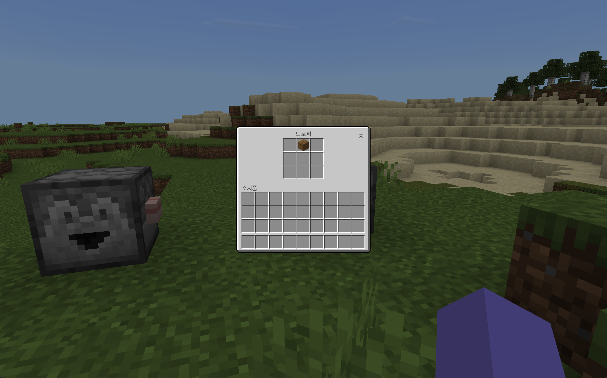

  <h1>Dropper for PocketMine-MP</h1>
  
PocketMine-MP 5.0.0 바닐라 투하기(Dropper) 블록 및 인벤토리 구현체

  

    
    
    
  

---

## Overview

PocketMine-MP 5.0.0 코어에 기본 구현되어 있지 않은 바닐라 마인크래프트 **투하기(Dropper)** 블록을 구현한 플러그인입니다.  
블록 설치, 파괴 시 아이템 드롭, NBT 기반 인벤토리 타일 엔티티 영속화 및 3x3 컨테이너 인터페이스를 지원합니다.

---

## Architecture & Components

| 컴포넌트 | 소스 경로 | 역할 |
|---|---|---|
| **Block** | `src/Block/Dropper.php` | 블록 배치 방향(Facing), 모델 및 상호작용 로직 |
| **Tile** | `src/Tile/Dropper.php` | 9개 슬롯의 아이템 데이터 영속 저장 (NBT 관리) |
| **Inventory** | `src/Inventory/DropperInventory.php` | 투하기 전용 3x3 인벤토리 컨테이너 UI 핸들러 |
| **Listener** | `src/Listener/EventListener.php` | 블록 터치 및 배치 이벤트 리스너 |

---

## Installation

1. 코드를 다운로드하거나 Phar 파일로 빌드합니다.
2. PocketMine-MP 서버의 `plugins/` 디렉토리에 배치합니다.
3. 서버를 구동하면 투하기 블록을 인게임에서 정상 배치하고 인벤토리를 사용할 수 있습니다.

---

## Preview

